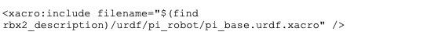

# 4.13.3 Копирование файлов из пакета rbx2\_description

Если вы хотите начать с некоторых файлов URDF/Xacro из пакета _rbx2\_description_, а затем внести изменения, скопируйте их в свой собственный каталог пакетов под соответствующим подкаталогом. Обратите внимание, что файлы Xacro в пакете rbx2\_description относятся к другим файлам в том же пакете. Поэтому вам придется отредактировать имя пакета и, возможно, путь и имя файла, чтобы оно совпадало с вашими собственными именами файлов. Например, следующее

Эта строка вытягивает базовую модель Pi из файла _pi\_base.urdf.xacro_, найденного в том же каталоге пакетов. Просто отредактируйте эту строку в вашей копии файла в соответствии с именем вашего пакета и расположением базового файла вашего робота.

Переведено с помощью _www.DeepL.com/Translator_ \(бесплатная версия\)

